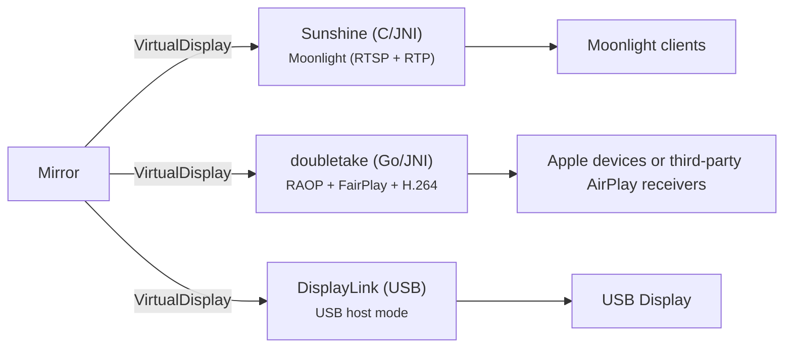

# Screen Mirroring Manager for Android

[](https://github.com/jqssun/android-display-mirror)
[](https://github.com/jqssun/android-display-mirror/releases)
[](https://github.com/jqssun/android-display-mirror/blob/main/LICENSE)
[](https://github.com/jqssun/android-display-mirror/actions/workflows/apk.yml)
[](https://github.com/jqssun/android-display-mirror/releases)

**Mirror** is an all-in-one application that forwards your screen content to external displays and expands Android's built-in screen mirroring capabilities. It creates virtual displays and supports screen sharing to:
- AirPlay receivers (Apple devices or third-party receivers using [UxPlay](https://github.com/FDH2/UxPlay) or [Android AirPlay](https://github.com/jqssun/android-airplay-server))
- [DisplayLink](https://www.synaptics.com/products/displaylink-graphics) adapters connected to the device via USB host mode
- [Moonlight](https://github.com/moonlight-stream) ([Nvidia GameStream](https://www.nvidia.com/en-us/support/gamestream/)) clients with remote control support via the built-in [Sunshine](https://github.com/lizardbyte/sunshine) server

It can be used in conjunction with [**Extend**](https://github.com/jqssun/android-display-extend) to turn any connected display or sink device into a secondary display where you can cast and control any application. You can also use this with [**Android AirPlay**](https://github.com/jqssun/android-airplay-server) or [**Moonlight for Android**](https://github.com/moonlight-stream/moonlight-android) to create a dummay display that stays in Picture-in-Picture.

## Usage

Mirror supports creating virtual displays and streaming to them without Shizuku. Remote input requires Shizuku: enable it in any supported mode (wireless debugging, USB debugging, or root) and grant access to this application. See [Shizuku documentation](https://shizuku.rikka.app/guide/setup/) for details. 

### Using with Extend
Mirror gets pixels onto a display. What application runs on it, where it renders, and how input is routed are handled by [Extend](https://github.com/jqssun/android-display-extend). The two applications connect through Android's display system via `DisplayManager` API.

## Compatibility

- Any device on Android 8.0+ (no privileged access required)
- (Optional) Receiver on the same subnet for AirPlay and Moonlight sinks
- (Optional) USB 2 or higher for DisplayLink sinks
- (Optional) [Extend](https://github.com/jqssun/android-display-extend) for managing the secondary display
- (Optional) [Shizuku](https://github.com/RikkaApps/Shizuku) for hidden API access

## Features

- Outbound AirPlay 2 (modern) or AirPlay 1 (legacy) screen mirroring to Apple devices or third-party AirPlay receivers
- Outbound Moonlight streaming and remote control, with Sunshine server built in
- DisplayLink USB output via USB 2 or USB 3 host mode
- Each display sink is registered as a virtual display via `DisplayManager` API allowing other applications to launch activities on it
- Touchscreen relay for remote pointer and keyboard input directed at the mirrored display

| Feature | Shizuku | Minimum API |
|---|:---:|:---:|
| AirPlay mirroring | N | 26 (`MediaProjection.createVirtualDisplay`) <br> 34 (`MediaProjectionConfig.createConfigForDefaultDisplay`) |
| DisplayLink USB output | N | 26 (`android.hardware.usb.host`) |
| Moonlight video streaming | N | 26 (`MediaCodec` H.264) <br> 28 (BT.709/BT.2020 color metadata) <br> 30 (`KEY_LOW_LATENCY`) |
| Moonlight H.265/HEVC encoding | N | 29 (`MediaCodecInfo.isHardwareAccelerated`) |
| Audio capture (playback submix) | N | 29 (`AudioPlaybackCaptureConfiguration`) |
| Audio capture (remote submix) | O | 31 (`REMOTE_SUBMIX`) |
| Cursor overlay | O | 26 (`TYPE_APPLICATION_OVERLAY`) |
| Remote device input | R | 26 (`IInputManager.injectInputEvent`) |
| Touchscreen relay with live preview | R | 31 (`setFocusedRootTask`) <br> 34 (`focusTopTask`) |
| Auto-match aspect ratio | R | 26 (`IWindowManager.setForcedDisplaySize`) |
| Trusted virtual display | R | 33 (`VIRTUAL_DISPLAY_FLAG_TRUSTED`, `OWN_DISPLAY_GROUP`, `ALWAYS_UNLOCKED`, `TOUCH_FEEDBACK_DISABLED`) <br> 34 (`DEVICE_DISPLAY_GROUP`) |
| Untrusted virtual display | F | 26 (`MediaProjection.createVirtualDisplay`) |
| Application mirroring | N | 26 (`ActivityOptions.setLaunchDisplayId`) <br> 29 (`ActivityManager.isActivityStartAllowedOnDisplay`) |
| Prevent auto-lock | R | 26 (`WRITE_SECURE_SETTINGS`) |
| Sharing logs | R | 26 (base) <br> 30 (`MANAGE_EXTERNAL_STORAGE`) |
| Disable USB audio output | R | 26 (`IAudioService.setWiredDeviceConnectionState`) <br> 33 (`IAudioService.getDevicesForAttributes`) |
| Display hotplug monitor | I | 26 (`DisplayManager.DisplayListener`) |

| Legend | Description |
|---|---|
| R | Required |
| O | Optional |
| F | Fallback |
| I | Inherited |
| N | Unused |

## Implementation

Native streaming servers are bridged to Android via JNI. The Moonlight path compiles [Sunshine](https://github.com/LizardByte/Sunshine) for Android and exposes a [`MediaProjection`](https://developer.android.com/reference/android/media/projection/MediaProjection) backed video source. Sunshine handles RTP packetization itself; [moonlight-common-c](https://github.com/moonlight-stream/moonlight-common-c) supplies the Limelight protocol headers, RTSP parser, and ENet UDP control transport. The AirPlay path is built on [doubletake](https://github.com/omarroth/doubletake), ported to Android via [Go mobile](https://github.com/golang/mobile) and patched for Apple devices and legacy AirPlay receivers. The DisplayLink path uses Android USB host mode with a user-imported vendor driver.



CMake drives the native C/C++ build under [`./app/src/main/cpp`](app/src/main/cpp). Submodules must be initialized before building. AirPlay is powered by [doubletake](https://github.com/omarroth/doubletake) with custom bindings under [`./doubletake`](doubletake/doubletake). This library needs to be built with [`./build.sh`](build.sh) first. Make sure `go` is available in `$PATH` before building.

```bash
git submodule update --init --recursive
./build.sh && ./gradlew assembleDebug
```

Check out the [CI](https://github.com/jqssun/android-display-mirror/blob/main/.github/workflows/apk.yml) for reproducible build instructions.

## Credits

- [LizardByte](https://github.com/LizardByte/Sunshine) for Sunshine server
- [Moonlight Game Streaming Project](https://github.com/moonlight-stream/moonlight-common-c) for Moonlight headers
- [Omar Roth](https://github.com/omarroth/doubletake) for open-source AirPlay sender `doubletake`
- [Tao Wen](https://github.com/taowen) for the open-source Android bindings of DisplayLink vendor driver
- [Xiph.Org Foundation](https://github.com/xiph/opus) for the Opus codec

---

Disclaimer: This project is not affiliated with Apple Inc or Synaptics Inc.
